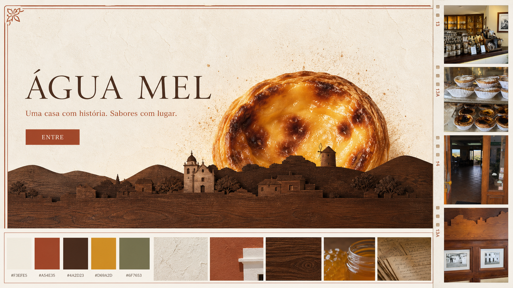

# Direção visual — O Sol de Alte

## Moodboard v1

Esta imagem é uma referência de atmosfera e composição. A igreja, o moinho, os cerros e o casario nela representados não devem ser usados como documentação histórica: a versão final será redesenhada a partir da peça em madeira e validada com a família.

## Sistema visual inicial

- Cal branca: `#F3EFE5`
- Terracota: `#A54E35`
- Madeira escura: `#4A2D23`
- Mel dourado: `#D69A2D`
- Verde-serra: `#6F7653`

## Princípios

- O pastel de nata funciona como sol, nunca como mascote ou elemento cartoon.
- A silhueta em madeira é a linha narrativa principal do site.
- A fachada inspira molduras e apontamentos, sem ocupar toda a identidade.
- As fotografias e vídeos aparecem como memória documental, em pequenas janelas.
- O movimento deve ser lento, tátil e opcional para quem prefere menos animação.
- A linguagem deve ser contemporânea, mas continuar a parecer uma casa familiar de Alte.

## Elementos que exigem fidelidade

- forma e ordem dos quatro cerros;
- posição e desenho da Igreja Matriz, moinho e restantes referências;
- seleção e legendas das fotografias antigas;
- cor e textura do pastel real da Água Mel.
